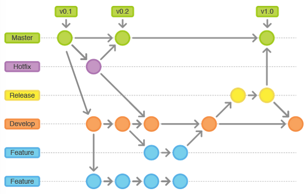

背景：
---
公司一直使用svn做版本管控，项目一般只有两个分支，开发区和发布区，开发人员在开发过程中提交代码，然后在测试部署环境，测试通过后将代码同步至发布区，从发布区打包上线到生产环境；

前端项目现在多采用MVVM架构，每次上线需要全量打包，再加上多人协作的场景下，svn的管控模式已经难以满足复杂的场景；

先分析下问题所在：
---
1、开发人员多，每个人都在发布区提交代码，发布区的代码经常出现一更新就无法运行，只能先一一排错；同时测试环境沦为鸡肋，因为没有对应的稳定版本；
2、并行开发的版本多，同时有3个以上的需求在开发，但上线的时间并不一致，导致开发区的代码无法作为测试版本，只能由开发人员自己提交发布区，测试人员在发布区打包上线并测试；发布区沦为测试区；
3、前端项目无法增量上线，每次上线需要发布人全量打包，发布区版本由发布人员认为管控，上线日需要多次打包测试；

因此考虑引入Git作为版本管理工具，对开发上线流程进行管理；

Git的优点
---
1. 由于是分布式，所有本地库包含了远程库的所有内容。
2. 优秀的分支模型，打分支以及合并分支，机器方便。
3. 快速，Git由于代码都在本地，打分支和合并分支及其快速

但即使是Git，没有一套规范约束，随着项目周期变长，参与人员变多，依旧会出现各种问题；

Gitflow
---
就像代码需要代码规范一样，代码管理同样需要一个清晰的流程和规范

Gitflow工作流通过为功能开发, 发布准备和维护分配独立的分支, 让发布迭代过程更流畅. 严格的分支模型也为大型项目提供了一些非常必要的结构. 

Gitflow工作流没有用超出功能分支工作流的概念和命令, 而是为不同的分支分配一个很明确的角色, 并定义分支之间如何和什么时候进行交互.


主要分支:
* Master(绿色): 主分支，保持稳定，不允许直接提交代码，只能从release分支和hotfix分支发起merge请求
* Develop(橙色): 开发分支，相对稳定，代码优化以及功能性开发；

辅助分支:
* Feature(蓝色): 开发新功能都从 develop 分支新建出来，完成后合并（merge）回 develop分支；
* Release(黄色): 准备要 release 的版本，只修改 bug。从 develop 分支出来，完成后 merge 回 master 和 develop
* Hotfix(灰色): 修复bug分支，等不及 release 版本就必须马上修复 master 赶上线的情况。会从 master 分支出来，完成后 merge 回 master 和 develop

在实际使用中，根据现场的情况，做了一些调整：
1. master分支，有版本管理人员负责，每次上线需要对master分支打版本tag；master需要时刻和生产环境保持一致，合并master分支由1-2个管理员负责，开发人员不可以直接提交到master分支；
2. develop分支，与测试环境保持一致；不建议直接在develop分支开发，尽可能以功能分支合并的形式更新develop分支，保证develop分支可用性；后期将加入持续集成，develop分支对应测试环境；
3. feature分支，是开发人员主要开发的分支，建议按照功能点来新建分支，每个功能是一个分支，开发人员自测要在feature分支完成，自测通过后，在上线周期内merge到develop分支，提交由测试人员测试；
4. 测试人员在测试环境测试出bug，指定开发人员需要基于develop新建release分支，开发人员在release分支修复bug，而后merge回develop分支，测试人员再进行测试；
5. 测试人员测试通过后，将release分支merge到master分支，进行上线发布；
6. 上线后，再次出现bug，需要开发人员在master分支基础上，新建hotfix分支，修复bug，修复后，merge到develop分支测试，测试通过后再merge到master分支，重新上线发布；
7. 如果上线失败（出现未能解决的bug，或者因为用户层面的原因）发布人员从master分支回退到上一个tag版本，然后执行上线回退；

gitFlow一些常用命令汇总：
1. 远程代码拉取到本地：
```bash
    git clone xxx
    git checkout -b develop origin/develop
```
2. 新建feature分支，命名方式以feature/功能名
```bash
	git checkout -b [branch-name]
	/* 新建分支只是在本地，需要把分支提交到远程服务器 */
	git push origin [branch-name]:[branch-name] 
```
3. 开发人员提交代码到feature分支
```bash
	git add *
    git commit -m '备注'
```
4. feature分支开发完成后，将本地的代码变更提交到远程
```bash
    /* 执行代码拉取操作，防止代码冲突 */
	git pull -rebase
	/* 解决代码冲突后，推送代码到远程仓库*/
	git push origin [branch-name] 
```
5. 本地自测过之后，合并feature分支到develop分支
```bash
	git checkout develop
	git merge [branch-name]
```
6. 合并完成后，删除对应的feature分支
```bash
	/* 删除本地分支 */
	git branch -d [branch-name]  
	/* 删除远程分支 */
	git push origin --delete [branch-name]  
```
7. 打tag
```bash
	/* 创建Tag */
	git tag -m "Task#003 v1.0.0 首版发布" v1.0.0.170718
	/* 推送Tag到远程仓库 */
	git push origin v1.0.0.170718
```


Git工具推荐
---
git Bash：  window下用适用于git的命令行工具，建议熟悉git还是从命令行开始；
sourceTree：拥有可视化界面的项目版本控制软件，适用于git项目管理，可以一目了然的看到分支合并的情况，同时可以看到每次提交时的文件列表的修改情况

