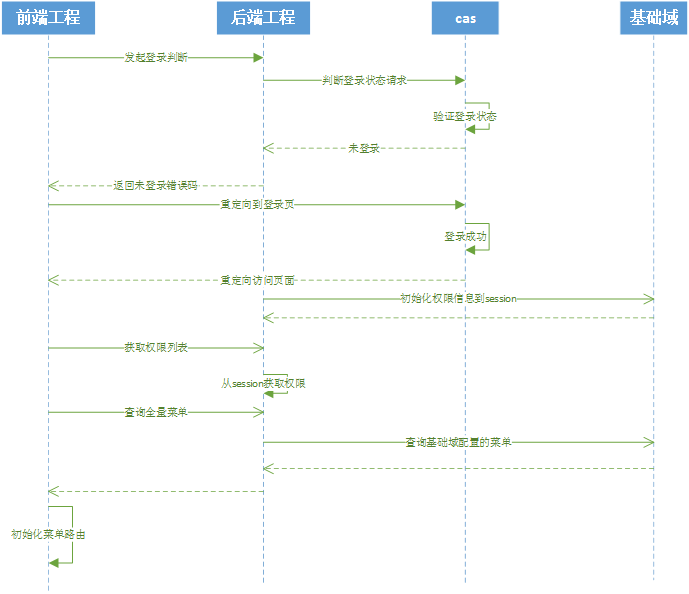

基于vue的管理系统的权限管控方案
===
近期在做后台管理系统，前端是vue + vue-router + vuex + webpack实现的spa应用；管理系统中有可视化编辑、工作流、运营数据、报表等不同的能力，需要开放给不同的用户角色使用，因此需要对菜单进行权限控制；

还有一些特殊的情况，由于运营数据和可视化配置是两个前端应用，展示效果是统一的，技术栈也相同（vue...），但是需要统一进行登录和权限管理；（后期也可能会有更多这样的情况，如：报表系统）

最终想要达到的目标：
1. 不同用户登录后看到的菜单不同；
2. 多个前端系统的菜单统一
3. 系统内的菜单是路由访问，系统外的菜单使用外链跳转；
4. 即使用户保存了前端路由，没有权限也无法访问；

设计方案
---
登录和权限管理我们有现成的产品，CAS+基础域；集成CAS后，即可通过基础域来管理角色和权限；因此方案是根据CAS和基础域来设计的；
* 首先：前端需要获取到当前登录的用户和权限；登录后，后端的session中是保存有用户信息和权限信息的，需要增加一个接口为前端返回这些信息；
* 第二：菜单需要根据权限信息展示，而基础域返回的权限信息只有url；因此需要现有全量的菜单，再根据权限做交集处理；最开始计划全量菜单写在前端工程里，但后续增加菜单需要在每个系统都做一次修改，不合理；基础域中导航管理模块的数据结构正好能满足要求，计划将菜单通过基础域配置，提供接口返回给前端使用，这样的话菜单也可以通过可视化配置，避免了频繁的开发上线；
* 第三：区分路由还是外链，在配置时统一配置完整的url，包含请求路径和hash值，在每个前端系统中配置自己的上下文，查询出的菜单与当前系统的上下文相同时，即为内部访问路由；如果不相同则表示外链
* 第四：VUE路由通过权限信息来生成，没有权限则没有路由，即使之前保存了路由也无法访问；保证了安全性；

#####时序图



在具体实现过程中，踩了不少坑，下面我将详细讲述下实现过程中的关键点：


集成CAS
---
登录的部分采用现有的CAS产品；CAS是SpringMVC架构实现的单点登录应用，有独立的登录界面，通过在目标应用的web.xml中配置过滤器、集成jar包的方式，在目标应用收到请求时，向CAS系统发起验证登录请求，如未登录则拦截请求，重定向至CAS登录界面；

在前后端分离的项目中，请求前端工程时，需要前端主动发起请求，判断登录状态，如未登录由前端重定向至CAS登录界面（后端返回指定错误码）；

在前端应用加载时就发起请求验证登录状态，可以在main.js中进行；如果未登录重定向至登录界面；
```bash
  axios({method: 'post', url: '/y/adm/market/sso/asynchronLoginCheckServlet', data: {}}).then(({ data }) => {
    if (data.code === '009999') {
      window.location.href = config.domain + '/cas/login?service=' + config.retDom + '/market/sso/asynchronLoginResServlet?page=' + window.location.origin + '/y/adm/market/index.html'; 
    }
  })
```


菜单初始化
---
#### 权限信息获取
登录成功后，后端应用的session中会保存当前登录用户的基本信息和权限信息；后端提供接口，在登录成功后获取session中的信息，数据结构如下：
```bash
{
	"data":
	{
		"authority":[],   //url权限列表
		"contactPhone":"13934900000",   
		"loginNo":"admin"  //登录账号
	},
	"retCode":"0000",
	"retMsg":"OK"
}
```

#### 菜单列表查询
采用基础域的权限模型
#### 补充查询sql，画一下UML图

#### 初始化菜单
拿到全量的菜单信息后，根据权限信息进行过滤，将没有权限的菜单剔除掉：

权限信息查询和菜单查询需要放在登录后进行，并且需要在权限获取后再进行菜单查询，否则在菜单渲染时，会出现权限列表尚未获取情况，导致菜单未经过滤全部展示出来；

因此权限信息获取接口和菜单列表接口需要处理竞态，竞态的处理建议放在同一个action中来做，如果写成两个action，处理竞态要麻烦很多；
```bash
  async fetchUserInfo ({ commit }, payload) {
    let response = null
    let response1 = null
    try {
      response = await initBase({})
      response1 = await qryMenu({})
      response.data.menuList = response1.data
      let rou = initAuthority(response.data)
      commit('SET_USER_BASE_INFO', response.data)
      return rou
    } catch (err) {
      console.error(err)
    }
  }
```
initAuthority方法处理三件事：
1、过滤menuList中没有权限的menu；
2、根据权限生成路由对象；
3、区分出内链和外链（系统内菜单还是系统外菜单）；
这里需要注意一点，为了菜单是系统内还是系统外，录入菜单url时，需要录入完整的url，
例如：http://xxx/111/222.html#333
由于系统的上下文不同，在处理时根据本系统的上下文来区分，是本系统的上下文，则只保留路由部分；非本系统则保留完整的url；
```bash
  data.menuList.filter(function (x) {
    x.childPortalNavs = x.childPortalNavs.filter(function (y) {
      y.childPortalNavs = y.childPortalNavs.map(function (z) {
        if (z.appVersionUrl.indexOf(config.host) > -1) {
          z.appVersionUrl = z.appVersionUrl.split('#')[1]
          z.out = false
        } else {
          z.out = true
        }
        return z
      })
      return y.childPortalNavs.length > 0
    })
    return x.childPortalNavs.length > 0
  })
```

commit设置status中的变量：
```bash
'SET_USER_BASE_INFO' (state, payload) {
    let {loginNo, contactPhone, authority, menuList} = payload
    state.userBase.name = loginNo
    state.userBase.phone = contactPhone
    state.userBase.authority = authority
    state.menuList = menuList
  },
```

#### Router（路由）管理
路由管理就是说，可访问的路由要和菜单保持一致；
但是vue-router的实例，在new vue实例的时候，就加载了，且必须加载，这个时候，登录路由一定要加载，可是这个时候没有登录，无法确定权限

解决思路很简单，菜单和路由同步，肯定是采用了vuex，一开始的思路的是，在一开始，就把所有的路由规则加载，然后在登录的时候，取得权限路由，对比两个路由，通过修改修改一个权限字段来隐藏菜单，如果在后台页面添加了新菜单规则，路由是按模块加载的不同的文件，这时对路由的文件进行新的读写，虽然可以解决问题，但是如果手动在浏览器地址上路由，依然可以访问，所以在路由的全局钩子上还要做拦截。

上面的思路可以解决问题，但是很繁琐；

幸运的是VUE在2.2版本以后，官方新增了api，addRoutes，专门针对服务端渲染路由，那么这下问题就比较简单了；

在前面initAuthority方法中，我们已经拿到了经过权限过滤的菜单列表了，只要再把列表中属于系统内的菜单生成路由对象，通过addRoutes动态加载到路由中就可以了；
```bash
const checkMenus = function (data) {
  data.menuList.forEach(function (x) {
    if (x.childPortalNavs.length > 0) {
      x.childPortalNavs.forEach(function (y) {
        if (y.childPortalNavs.length > 0) {
          y.childPortalNavs.forEach(function (z) {
            if (!z.out) {
              rou.children.push({
                path: z.appVersionUrl,
                name: z.naviName,
                component: componentMap[z.appVersionUrl]
              })
            }
          })
        }
      })
    }
  })
  return rou
}
```

前面的代码中，initAuthority方法返回的就是生成的路由对象：
```bash
store.dispatch('easyMarketing/fetchUserInfo', null, { root: true }).then(rou => {
   router.addRoutes([rou])
});
```

#### 菜单渲染
菜单根据menuList渲染即可，渲染时根据是否系统外菜单增加a标签
```bash
  <el-menu-item :index="item2.out ? '' : item2.appVersionUrl" v-for="item2 in item1.childPortalNavs" :key="item2.naviId">
    <a :href="item2.appVersionUrl" v-if="item2.out" style="color:rgb(143, 151, 161);">
      {{item2.naviName}}
    </a>
    <a style="color:rgb(143, 151, 161);" v-else>
      {{item2.naviName}}
    </a>
  </el-menu-item>
```
需要注意一点：渲染时，系统外的菜单，菜单路由要为空，否则会出现先切换路由再触发a标签的跳转，浏览器选择上一步时就会出现空页面；

总结
---
1、菜单结构保持3级，只有最小级的菜单有访问路由；
2、根据系统上下文区分菜单是否本系统菜单；
3、使用addRoutes动态生成路由，保证路由和菜单的一致性，没有权限的菜单即使知道路由也无法访问；
4、权限信息查询和菜单查询要放在一个action中查，使用异步开发手段处理好竞态；
5、外链菜单渲染时路由参数置空，保证系统间切换的一致性性；

##### 此方案可复用至多个前端系统共享菜单的场景，菜单管理只需要在基础域中进行配置，前端工程无需改造；